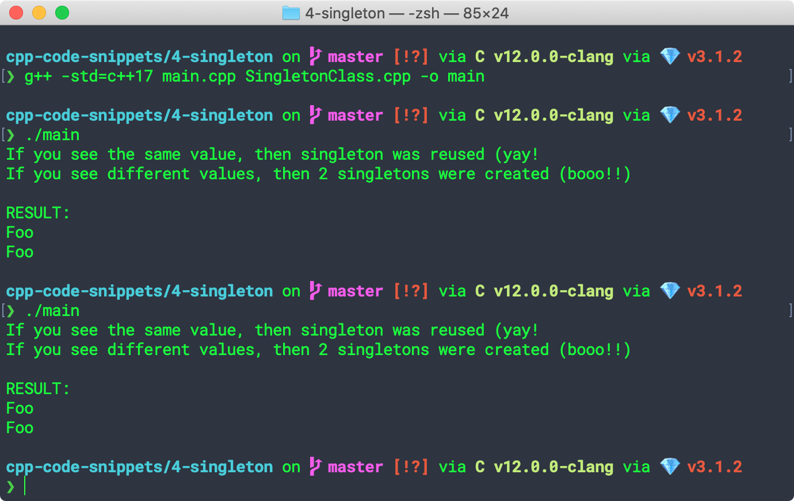
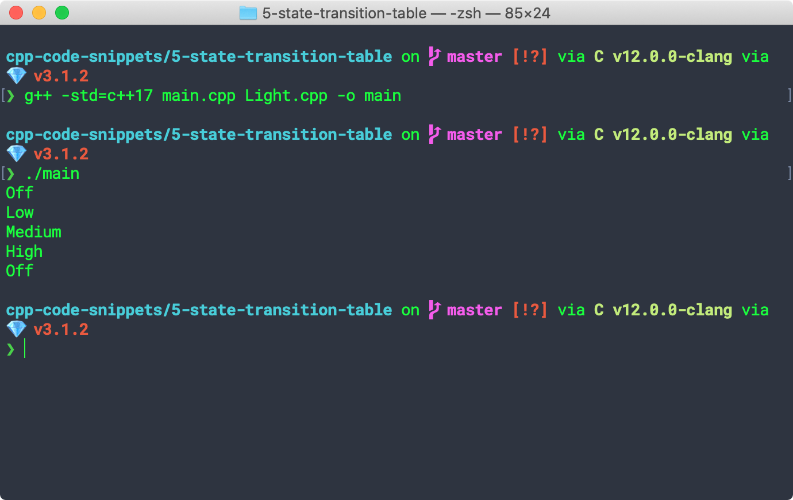

## C++ Code Snippets

### 0-hello-world

### 1-command-line-arguments

### 2-enum

### 3-enum-class

### 4-singleton

[source](https://refactoring.guru/design-patterns/singleton/cpp/example#example-1)

### 4-state-transition-table

[source](https://www.aleksandrhovhannisyan.com/blog/implementing-a-finite-state-machine-in-cpp/)

### 5-finite-state-machine

