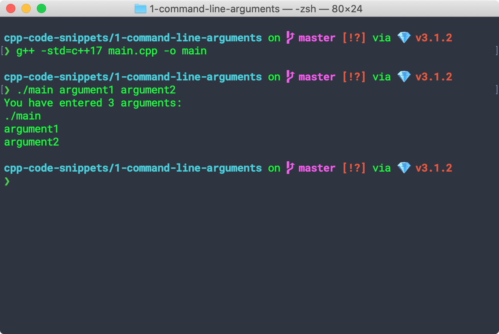

## C++ Code Snippets

### 0-hello-world

A classic example.

```bash
cd 0-hello-world
g++ -std=c++17 hello-world.cpp -o hello
./hello
```


### 1-command-line-arguments

Prints out the number of arguments entered and the arguments.

```bash
g++ -std=c++17 main.cpp -o main
./main argument1 argument2
```

