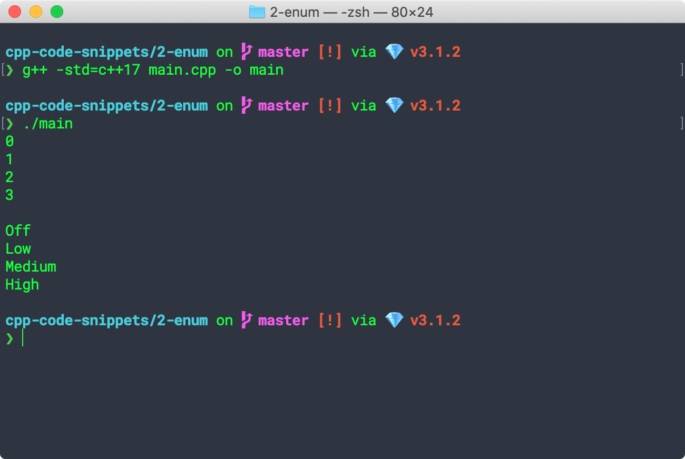

## C++ Code Snippets

### 0-hello-world

A classic example.

```bash
cd 0-hello-world
g++ -std=c++17 hello-world.cpp -o hello
./hello
```


### 1-command-line-arguments

Prints out the number of arguments entered and the arguments.

```bash
g++ -std=c++17 main.cpp -o main
./main argument1 argument2
```


### 2-enum

Defines and prints out the values of an [enum](https://en.cppreference.com/w/cpp/language/enum)

```bash
g++ -std=c++17 main.cpp -o main
./main
```



### 3-enum-class

Defines a enum class (with overriden output handler).


### 4-singleton

[source](https://refactoring.guru/design-patterns/singleton/cpp/example#example-1)

